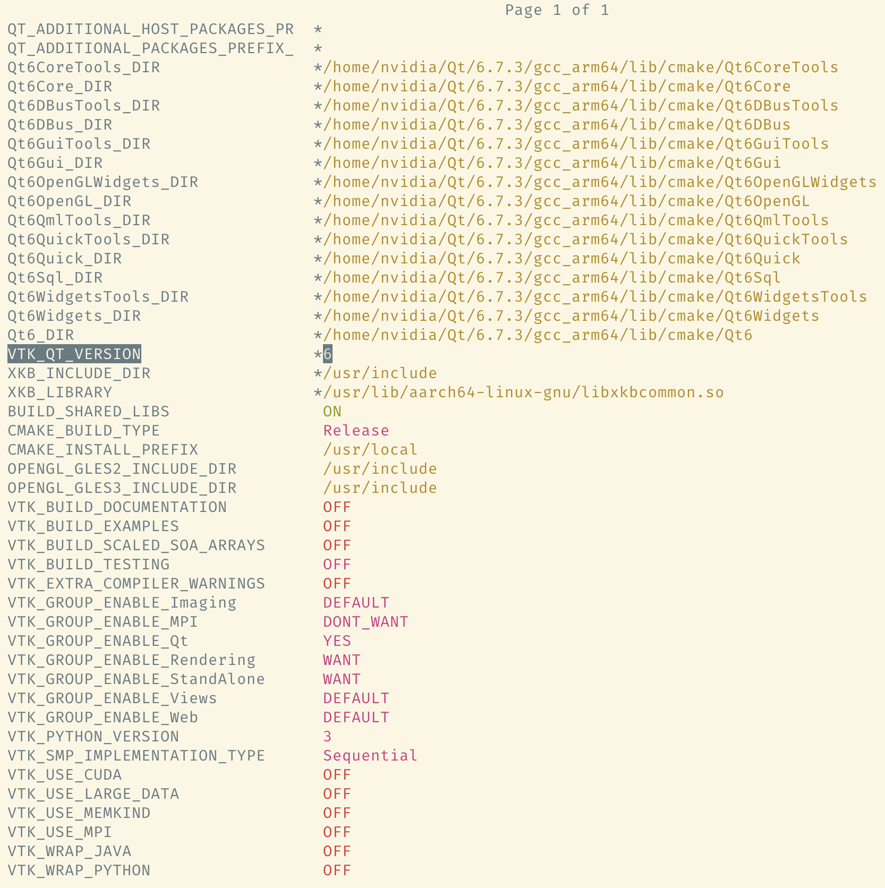
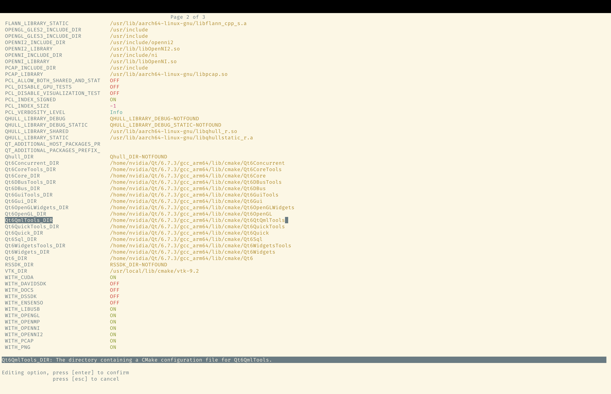

# qt6.7.3

直接用在线安装即可,可能会缺少以下组件,需要手动安装.

```shell
设置环境变量
export Q
```

## 可能缺少库

```shell
sudo apt install libxcb-cursor-dev
```

# vtk9.2.6

## 设置
pcl1.13.0版本需要 *<vtkMuteLock.h>*,9.2.6往后版本已经删除.

```shell
git clone -b v9.2.6 --recursive https://gitlab.kitware.com/vtk/vtk.git ~/vtk

cd ~/vtk && mkdir build && cd build
# 系统如果是高版本gcc或clang,会报错.
ccmake -G Ninja -DCMAKE_BUILD_TYPE=Release -DCMAKE_CXX_COMPILER=/usr/bin/g++-9 -DCMAKE_C_COMPILER=/usr/bin/gcc-9 ..
```

弹出页面按c生成,*VTK_GROUP_ENABLE_Qt*选YES.
接着按c继续生成,报错后e返回修改如图.
*Qt6QmlTools_DIR*路径补上/Qt安装路径/6.7.3/系统架构/lib/cmake/Qt6QmlTools.
*VTK_QT_VERSION*改为6.
按c生成后q退出.


## 编译
```shell
cmake .
cmake --build .
sudo cmake --install .
```

## 卸载
sudo cmake --uninstall .
```shell
```

# pcl1.13.0

## 设置

```shell
git clone -b pcl-1.13.0 https://github.com/PointCloudLibrary/pcl.git ~/pcl

cd ~/pcl && mkdir build && cd build
ccmake -G Ninja -DCMAKE_BUILD_TYPE=Release -DCMAKE_CXX_STANDARD=17 -DWITH_QT=QT6 ..
```

弹出页面按c生成,
*Qt6QmlTools_DIR*路径补上/Qt安装路径/6.7.3/系统架构/lib/cmake/Qt6QmlTools.
按c生成后q退出.


## 编译
```shell
cmake .
cmake --build .
sudo cmake --install .
```

## 卸载
```shell
sudo cmake --uninstall .
```


